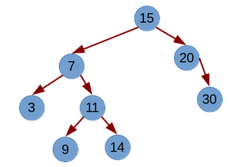

# Implementación enlaza del TAD Árbol Binario

*© F.J. Madrid Cuevas (fjmadrid@uco.es). Estructura de Datos. Grado de Ingeniería Informática. Universidad de Córdoba. España*

## Objetivos

* Implementar una versión enlazada del TAD Árbol Binario.
* Implementar funciones de utilidad en un árbol:
   * Cálculo de la altura y tamaño de un árbol.
   * Recorridos en profundidad.
   * Recorrido en Anchura.
* Implementar operaciones “en orden” sobre el árbol binario.

## Descripción

Esta práctica consiste en desarrollar una implementación enlazada del TAD BinaryTree y varias operaciones sobre el árbol binario como son el plegado/desplegado del árbol, cálculo de la altura y el tamaño del árbol y los recorridos en profundidad y anchura.


Para plegar un árbol se utilizará la gramática siguiente.

```
‘[]’ si está vacío
‘[ ‘<T>‘ ’<BTree[T] izq.>‘ ’<BTree[T] der.>’ ]’
```

Así dado el árbol:



La salida plegada debería ser:  

```
[ 15 [ 7 [ 3 [] [] ] [ 11 [ 9 [] [] ] [ 14 [] [] ] ] ] [ 20 [] [ 30 [] [] ] ] ]
```

Este árbol tiene una altura igual a 3.

Por otro lado los recorridos prefix, infix, postfix y en anchura dado el árbol anterior serían (hay espacio al final de cada línea):

```
15 7 3 11 9 14 20 30 
3 7 9 11 14 15 20 30 
3 9 14 11 7 30 20 15 
15 7 20 3 11 30 9 14 
```

Además el árbol indicado está en orden, ya que el recorrido en orden del árbol, genera una secuencia ordenada de valores. Si el árbol está en orden la inserción del nuevo valor 15 implica crear un nodo nuevo como hijo izquierdo del nodo 20.

## Evaluación


Superar todos los tests de:
	
- test_btree_node tests_btree_node 	1 puntos.
- test_btree tests_btree_fold_unfold 3 puntos.
- test_btree tests_btree_height_size 2 puntos.
- test_btree tests_traversals 2 puntos.
- test_btree tests_inorder 2 puntos.
