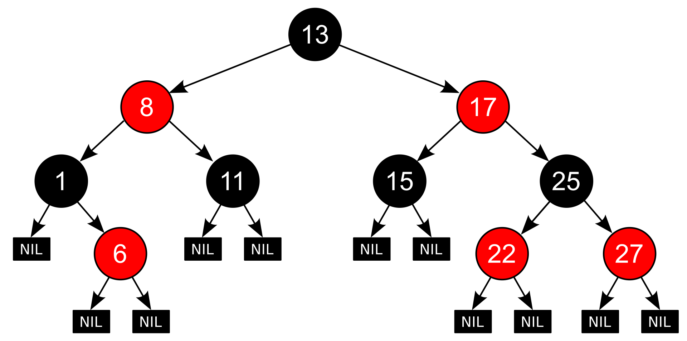

# Implementación del TAD RBTree[T]

*© F.J. Madrid Cuevas (fjmadrid@uco.es)
Estructuras de Datos. Grado de Ingeniería Informática. Universidad de Córdoba. España*

## Objetivos

- Implementar el TAD Árbol Binario de Búsqueda (BSTree).
- Implementar el TAD Árbol Rojo-Negro (RBTree).

## Descripción

En esta práctica se propone implementar el TAD RBTree[T]. Un árbol Rojo-Negro es un árbol binario de búsqueda “casi” equilibrado en altura. En la Figura 1 tienes un ejemplo.

<div style="margin-left: auto;
            margin-right: auto;
            width: 50%">

||
|:--|
|**Figura 1.** *Ejemplo de árbol Rojo-Negro. Observa como no hay dos nodos rojos seguidos y el número de nodos negros en cada rama desde la raíz a una hoja es el mismo.*|

</div>

La práctica se estructurará en dos etapas:

- La primera etapa se debe implementar sólo las operaciones de árbol binario de búsqueda (```__ONLY_BSTREE__```): localización, inserción y borrado de claves sin implementar los algoritmos de equilibrado. También se implementará la generación de un árbol binario de búsqueda perfectamente equilibrado conocidas todas las claves a insertar.

- En la segunda etapa, se deben implementar las operaciones para obtener el árbol de búsqueda “casi” equilibrado.

## Evaluación

La distribución de puntos para evaluar la práctica será la siguiente:
<div style="margin-left: auto;
            margin-right: auto;
            width: 50%">

| Test | Puntos |
| :--- | :-: |
|`test_bstnode tests_bstnode`| 1 |
|`test_bstree tests_bstree`| 3 |
|`test_bstree tests_bstree_perfectly_balanced`| 1 |
|`test_rbtree tests_rbtnode`| 1 |
|`test_rbtree tests_rbtree_inserting`| 2 |
|`test_rbtree tests_rbtree_removing`| 2 |
</div>
